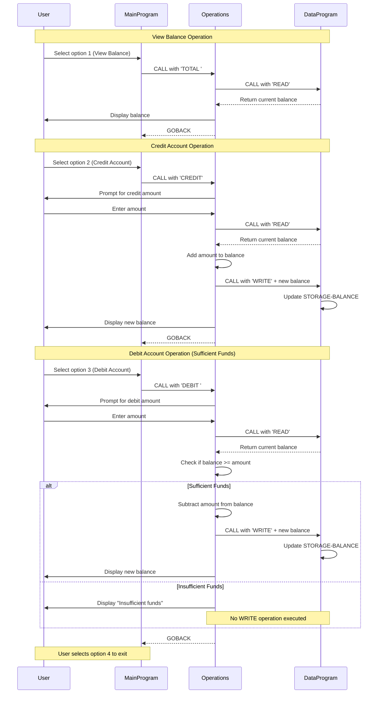

# COBOL Student Account Management System Documentation

## Overview

This COBOL application provides a simple account management system for handling student account balances. The system allows users to view balances, credit accounts, and debit accounts through an interactive menu-driven interface.

## System Architecture

The application follows a modular three-tier architecture:
- **Presentation Layer**: User interface and menu system (`main.cob`)
- **Business Logic Layer**: Account operations and validation (`operations.cob`)
- **Data Layer**: Balance storage and persistence (`data.cob`)

---

## COBOL Files Documentation

### 1. main.cob (MainProgram)

**Purpose**: Entry point and user interface controller for the account management system.

**Key Functions**:
- Displays the main menu with available operations
- Accepts user input for menu navigation (choices 1-4)
- Routes user requests to the appropriate operations
- Controls the application lifecycle (loop until exit)

**Menu Options**:
1. View Balance - Displays current account balance
2. Credit Account - Adds funds to the account
3. Debit Account - Withdraws funds from the account
4. Exit - Terminates the application

**Variables**:
- `USER-CHOICE`: Stores the user's menu selection (1-4)
- `CONTINUE-FLAG`: Controls the main program loop ('YES' or 'NO')

**Business Logic**:
- Input validation: Rejects invalid menu choices
- Delegates all account operations to the Operations program
- Provides a clean exit mechanism

---

### 2. operations.cob (Operations)

**Purpose**: Implements the core business logic for all account operations including balance inquiries, credits, and debits.

**Key Functions**:

#### VIEW BALANCE ('TOTAL ')
- Retrieves current balance from the data layer
- Displays the balance to the user
- No modifications to account data

#### CREDIT ACCOUNT ('CREDIT')
- Prompts user to enter credit amount
- Retrieves current balance
- Adds credit amount to balance
- Saves updated balance
- Displays new balance confirmation

#### DEBIT ACCOUNT ('DEBIT ')
- Prompts user to enter debit amount
- Retrieves current balance
- Validates sufficient funds are available
- If funds available:
  - Subtracts debit amount from balance
  - Saves updated balance
  - Displays new balance confirmation
- If insufficient funds:
  - Rejects transaction
  - Displays error message
  - Balance remains unchanged

**Variables**:
- `OPERATION-TYPE`: Stores the operation to perform (TOTAL/CREDIT/DEBIT)
- `AMOUNT`: Stores the transaction amount for credit/debit operations
- `FINAL-BALANCE`: Working variable for balance calculations

**Integration**:
- Calls `DataProgram` with 'READ' operation to retrieve balance
- Calls `DataProgram` with 'WRITE' operation to persist balance changes

---

### 3. data.cob (DataProgram)

**Purpose**: Data access layer responsible for storing and managing the account balance.

**Key Functions**:

#### READ Operation
- Returns the current stored balance
- No modifications to stored data
- Used by Operations program before any transaction

#### WRITE Operation
- Updates the stored balance with new value
- Persists balance changes in memory
- Used after credit/debit transactions

**Variables**:
- `STORAGE-BALANCE`: Persistent storage for account balance (initialized to 1000.00)
- `OPERATION-TYPE`: Internal storage for the requested operation
- `PASSED-OPERATION`: Input parameter indicating READ or WRITE
- `BALANCE`: Input/output parameter for balance value

**Data Format**:
- Balance format: `PIC 9(6)V99` (supports values up to 999,999.99 with 2 decimal places)

---

## Business Rules

### Account Balance
1. **Initial Balance**: All accounts start with a balance of $1,000.00
2. **Balance Limits**: 
   - Minimum balance: $0.00 (cannot go negative)
   - Maximum balance: $999,999.99 (6 digits + 2 decimal places)
3. **Precision**: All amounts maintain 2 decimal places for currency accuracy

### Transaction Rules

#### Credit Transactions
- No upper limit on credit amounts (within system maximum)
- Credit amount must be entered by user
- Balance is immediately updated upon credit
- System confirms new balance after transaction

#### Debit Transactions
- **Overdraft Protection**: Debit requests exceeding available balance are rejected
- Validation: System checks `FINAL-BALANCE >= AMOUNT` before processing
- Rejected debits display "Insufficient funds" message
- Rejected debits do not modify the account balance
- Successful debits display new balance confirmation

### Data Integrity
- Balance is stored in a single persistent location (`STORAGE-BALANCE`)
- All operations use READ-then-WRITE pattern to ensure data consistency
- No concurrent transaction support (single-user system)

### User Input
- Menu choices must be 1-4 (validated)
- Invalid menu choices prompt re-entry
- Transaction amounts must be numeric values
- Amount format follows COBOL `PIC 9(6)V99` specification

---

## Program Flow

```
┌─────────────┐
│  MainProgram│
│  (main.cob) │
└──────┬──────┘
       │
       │ Displays menu & accepts input
       │
       ▼
┌─────────────┐
│ Operations  │◄────┐
│(operations. │     │
│    cob)     │     │ Calls for READ/WRITE
└──────┬──────┘     │
       │            │
       │            │
       ▼            │
┌─────────────┐    │
│ DataProgram │────┘
│  (data.cob) │
└─────────────┘
```

1. User launches MainProgram
2. Menu displays and accepts user choice
3. MainProgram calls Operations with operation type
4. Operations calls DataProgram to READ current balance
5. Operations performs business logic and validation
6. Operations calls DataProgram to WRITE updated balance (if applicable)
7. Operations displays result to user
8. Control returns to MainProgram menu
9. Loop continues until user selects Exit

---

## Technical Notes

- **Language**: COBOL (legacy mainframe/enterprise standard)
- **Architecture**: Modular design with separation of concerns
- **Communication**: Programs communicate via CALL statements with parameters
- **State Management**: Balance persists in memory during program execution
- **No File I/O**: Current implementation uses in-memory storage only
- **Session Scope**: Balance resets to $1,000.00 when program restarts

## Future Enhancements

Potential modernization improvements:
- Persistent storage (database or file system)
- Multi-account support with student ID lookup
- Transaction history and audit trail
- Account types (checking, savings, etc.)
- Interest calculation
- Transfer between accounts
- Administrative functions (create/close accounts)
- Integration with modern web/mobile interfaces

---

## Sequence Diagram - Application Data Flow

The following sequence diagram illustrates the data flow between components for the three main operations: viewing balance, crediting an account, and debiting an account.



### Data Flow Summary

**View Balance**: Simple read operation with no data modification
- MainProgram → Operations → DataProgram (READ) → Display to User

**Credit Account**: Read-Modify-Write pattern
- MainProgram → Operations → DataProgram (READ) → Add amount → DataProgram (WRITE) → Display to User

**Debit Account**: Conditional Read-Modify-Write pattern
- MainProgram → Operations → DataProgram (READ) → Validate funds → [If OK: DataProgram (WRITE)] → Display to User
- Validation ensures balance never goes negative
